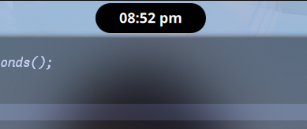
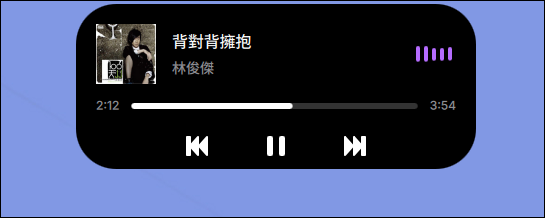

# Dynamic-island-on-hyprland
- Dynamic Island is a smooth, flexible, and fast interactive island component designed for Hyprland users.

- Based on Quickshell and C++ /Qt 6.

- Pursuting lightweight, smooth anim, and low-latency performance. (Talking about some latency)

### usage:

Memory usage: < 100 Mb (PSS)

CPU usage < 2%

## Description:

https://github.com/user-attachments/assets/d05c8da3-e84e-4a5e-ac06-b6ea97578781


#### style 1: normal - only show time

<div align="left">
  
</div>

#### style 2: split - when brightness, volume, bluetooth, etc. changes

<div align="left">
  
</div>

#### style 3: long-capsules - when workspace changes

<div align="left">
  
</div>

#### style 4: control-center - when right click

<div align="left">
  
</div>


#### style 5: expanded - when click/ song changes

<div align="left">
  
</div>

### Dependencies:

#### Build-time Dependencies (Compiling the backend)
- CMake (>= 3.16)

- C++17 Compiler (GCC or Clang)

- Qt6 SDK: Specifically Core, Qml, Network, and DBus modules

- libudev-dev: Required for monitoring battery status via udev

#### Runtime Environment

- Hyprland

- Quickshell

- pactl

- wpctl

- UPower DBus service and access to /sys/class/power_supply

#### Assets & Scripts

- JetBrainsMono Nerd Font (For icons and mono text)

- Inter & Inter Display (For UI text)

- custom scripts

>Please rewrite the script path in UserConfig.qml

### Compile & run:

- Download 
```bash
git clone https://github.com/enhaoswen/Dynamic-Island-on-Hyprland.git && cd Dynamic-Island-on-Hyprland
```

> make sure you change the program if is necessary, check important things at the end.


- Build 

```bash
mkdir build && cd build && cmake .. && make -j$(nproc)
mkdir -p ~/.config/quickshell/IslandBackend
mv *.so qmldir ~/.config/quickshell/IslandBackend/
mv ../*.qml ~/.config/quickshell/
```

- Clean 

```bash
cd ../.. && rm -rf Dynamic-Island-on-Hyprland
```

- To run in Hyprland:
```bash
QML2_IMPORT_PATH=~/.config/quickshell quickshell
```

## Important thing

- **For custom scripts, please make your own and change the path in UserConfig.qml**

- **The backend is hardcoded to read /sys/class/backlight/intel_backlight/. If you are using AMD or a different backlight driver, please update the path (SysBackend.cpp:353).**

- **The status of caps lock is currently polled via hyprctl devices. Ensure hyprctl is in your $PATH.**
